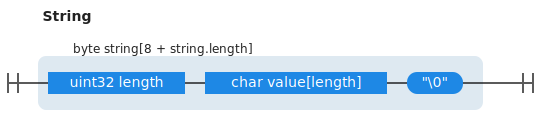
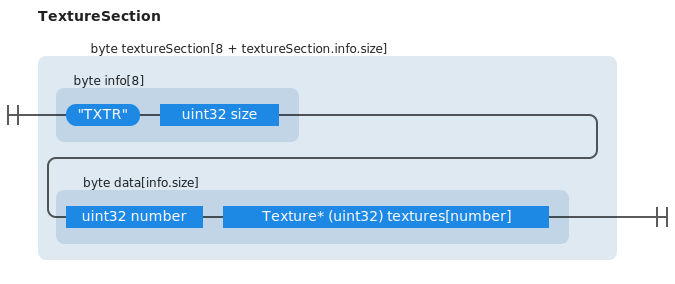
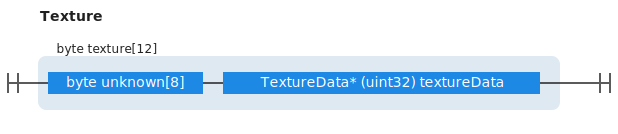
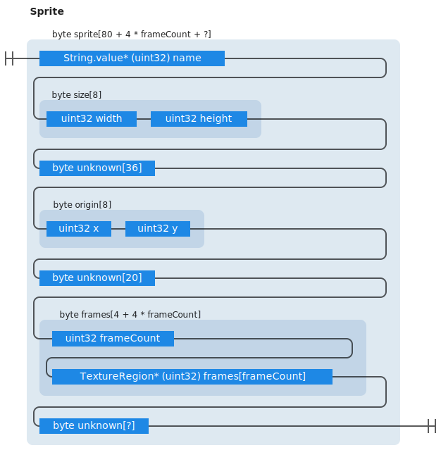

# LibUnx

A simple package for reading `.unx` files.

Games that use this file format:

* Forager (tested, see example)

## File format


### String section




### Texture section





The size of the texture data can be calculated by looking at the texture positions in the section:

```c++
for(auto i = 0; i < textures.number - 1; i++) {
    textures[i].size = textures[i + 1].position - textures[i].position;  
}
textures[textures.number - 1].size = section.size - (textures[textures.number - 1].position - section.position); 
```

### Texture region section


### Sprite section




Sprite name points directly to a string value, instead of trying to load it again, we can reuse the loaded string
section by trying to look it up by position `String.value* - 4`.
